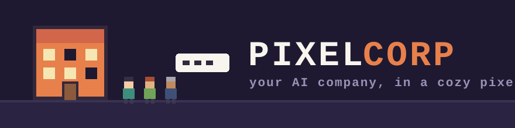
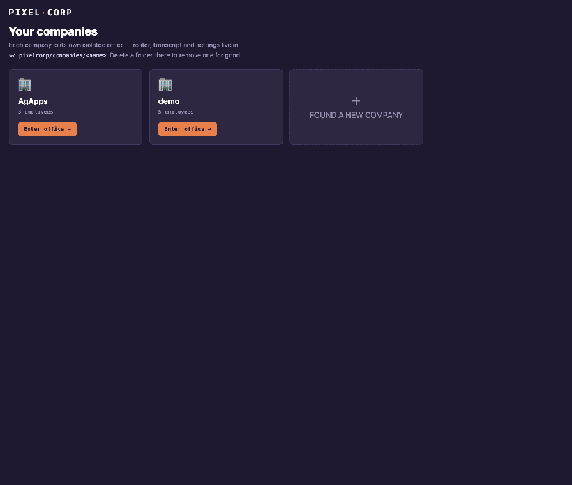

<p align="center">
  
</p>

<p align="center">
  <a href="LICENSE"></a>
  
  
  
</p>

<h3 align="center">Hire AI agents as employees. Give them repos. Watch your org chart work.</h3>

<p align="center">
  
</p>
<p align="center"><sub>Live demo: entering the office, walking with arrow keys, tasking the CTO, and the
delegation approval card. <a href="assets/screenshot.png">Full-res screenshot →</a></sub></p>

---

**pixelcorp** turns a team of LLM agents into a tiny company you run from a
pixel-art office on `localhost`. You're the Boss: walk your avatar around
with the arrow keys, press <kbd>Enter</kbd> next to an employee to talk,
hand the CTO something big, and watch the delegation ripple down the org
chart — with an approval card waiting for *your* click before any work is
handed down.

No cloud, no accounts, no telemetry. Rosters and transcripts are plain
files on your machine.

## ✨ Features

- 🕹️ **A real office, not a dashboard** — hand-crafted pixel scene with desks,
  a CEO cabin, kitchen, lounge, ping-pong corner… and an office cat. Working
  employees' monitors visibly light up with green code.
- 🔑 **Zero API keys to start** — the default engine drives the
  [Claude Code](https://claude.com/claude-code) CLI, so employee turns bill
  the Claude subscription you already have. Copilot CLI and free local
  Ollama models work the same way; API keys are optional, not required.
- 🏢 **Org charts that do something** — managers get a `delegate` tool and
  genuinely split work across their reports, then synthesize the results.
  Depth-capped, round-capped, and visible in the office as it happens.
- ✅ **You approve every delegation** — an approval card pops up before work
  is handed down. Deny it and the manager must cope. (`PIXELCORP_AUTO_APPROVE=1`
  for hands-free mode.)
- 📂 **Charters = file access** — each employee may touch *only* the repos
  you grant them, at the permission level you choose (read / write / run).
  Different agents can own different local repos and work in parallel.
- ⚙️ **Live work logs** — "thinking…", "waiting on Ravi…", "synthesizing
  results…" stream into the office, the roster, and the chat panel.
- 🧑‍🤝‍🧑 **Hire & fire from the UI** — new hires pick a desk instantly; every
  employee has editable settings (role, persona, manager, engine, model)
  and a charter editor.
- 🏙️ **Multiple companies** — a launcher screen of isolated offices, each
  with its own roster and transcript. Found a new one in two clicks.
- 📝 **Markdown chat** — replies render with full Markdown (marked +
  DOMPurify), so code blocks and tables from your engineers look right.

## 🚀 Quick start

```sh
git clone https://github.com/ankitgarg0006/pixelcorp
cd pixelcorp
npm install
npm start        # opens http://localhost:4310
```

That's it. If you're signed into Claude Code (`claude` runs in your
terminal), the demo company works immediately — **no API key**. Enter the
office, click **Dev · CTO**, and try:

> plan a dark-mode feature for my app and split the work

Then approve the delegations and watch the pod light up.

## 🔌 Engines

Every employee carries their own engine + model, so one company can mix all
of these:

| Engine | Auth | Cost | Notes |
|---|---|---|---|
| **Claude Code CLI** *(default)* | your `claude` sign-in | your Claude subscription | models: default / sonnet / opus / haiku |
| **Copilot CLI** | your GitHub sign-in | your Copilot plan | `npm i -g @github/copilot` |
| **Ollama** | none | free, local | any model you've pulled |
| **Anthropic API** | `ANTHROPIC_API_KEY` | per-token | live model list in the UI |
| **OpenAI-compatible API** | `OPENAI_API_KEY` / `apiKeyEnv` | per-token | OpenAI, DeepSeek, Groq… via `baseURL` |

```jsonc
// examples of an employee's "provider" in company.json
{ "type": "cli", "tool": "claude", "model": "haiku" }
{ "type": "openai", "baseURL": "https://api.deepseek.com/v1",
  "model": "deepseek-chat", "apiKeyEnv": "DEEPSEEK_API_KEY" }
{ "type": "openai", "baseURL": "http://localhost:11434/v1", "model": "llama3.2" }
```

## 🔐 The security model

Agents touching your filesystem deserve suspicion, so access is
deny-by-default:

1. **No charter → no file access.** A freshly hired employee can chat and
   think, nothing more.
2. **Charter repos are a hard boundary.** On the Claude Code engine the
   first charter repo becomes the agent's working directory and the rest
   are granted explicitly — the CLI's own permission system blocks
   everything else.
3. **Permissions are graded** — read-only, read+write, or read+write+run,
   mapped to the CLI's tool allowlist.
4. **Delegations wait for you.** Nothing fans out across your team without
   an explicit Approve click (unless you opt out).
5. **Everything is auditable** — the full transcript, including delegation
   chains, is an append-only `messages.jsonl` you can read with `cat`.

## 🗂 Data layout

```
~/.pixelcorp/
  companies/
    <company-name>/
      company.json     # roster: personas, managers, engines, charters
      messages.jsonl   # append-only transcript (chat + delegations)
```

Plain files, no database. Edit them by hand, back them up, commit them to a
private repo — changes apply on the next message. Delete a company folder
to remove it for good.

## 🗺 Roadmap

- **Claude Agent SDK engine** — deeper agent loops with native repo tools
  and session resume.
- **MCP servers per employee** — attach a database, browser, or issue
  tracker to a charter so each hire has genuinely different abilities.
- **Ambient office life** — coffee runs, water-cooler chats, standups on
  the lounge sofas, and ping-pong matches between idle employees (the ball
  is waiting on the table).
- **Meetings** — scheduled multi-agent conversations with minutes posted
  to the feed.
- **Voice** — talk to whoever you're standing next to.
- **Tileset skins** — pluggable art packs on top of the built-in sprites.

## 🤝 Contributing

PRs and issues welcome. The codebase is deliberately small and boring:

```
bin/        one-file CLI launcher
server/     Node (no framework): store, providers, orchestrator, http+ws
web/        vanilla JS: pixel renderer + UI (no build step)
```

Run `npm start`, edit, refresh. If you're adding a provider, implement the
one-function contract in `server/providers.js` — everything else is wired.

## 📄 License

[MIT](LICENSE) © 2026 agapps

Built with [Claude Code](https://claude.com/claude-code) — including this
sentence.
